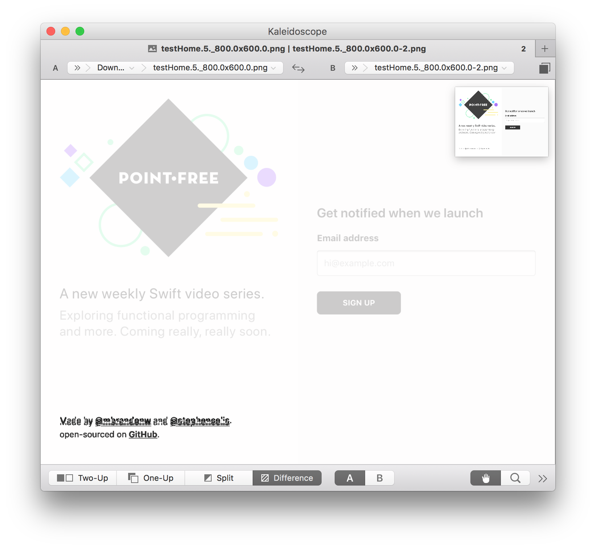

# SnapshotTesting

[](https://swift.org/download/) [](https://circleci.com/gh/pointfreeco/swift-snapshot-testing) [](https://travis-ci.org/pointfreeco/swift-nonempty) [](https://twitter.com/pointfreeco)

Snapshot testing for views, data, and more!

## Getting Started

Once the library [is installed](#installation), no additional configuration is required. You can import the `SnapshotTesting` module into a test and pass a value to the `assertSnapshot` function.

``` swift
import SnapshotTesting
import XCTest

class MyViewControllerTests: XCTestCase {
  func testMyViewController() {
    let vc = MyViewController()

    assertSnapshot(matching: vc, as: .image)
  }
}
```

When the test first runs, a snapshot is recorded automatically to disk and the test will fail and print out the file path of the reference.

> 🛑 failed - Recorded: …
>
> "…/MyAppTests/\_\_Snapshots\_\_/MyViewControllerTests/testMyViewController.png"

Repeat test runs will load this reference for comparison. If the images don't match, the test will fail and print out the file path of each image for further inspection.

You can record a new reference by setting `record` mode to `true` on the assertion or globally.

``` swift
assertSnapshot(matching: vc, as: .image, record: true)

// or globally

record = true
assertSnapshot(matching: vc, as: .image)
```

<!--
## Configuration

TODO
-->

## Installation

### Carthage

If you use [Carthage](https://github.com/Carthage/Carthage), you can add the following dependency to your `Cartfile`:

``` ruby
github "pointfreeco/swift-snapshot-testing" "master"
```

### CocoaPods

If your project uses [CocoaPods](https://cocoapods.org), add the pod to any applicable test targets in your `Podfile`:

```ruby
target 'MyAppTests' do
  pod 'SnapshotTesting', :git => 'https://github.com/pointfreeco/swift-snapshot-testing.git'
end
```

### Swift Package Manager

If you want to use SnapshotTesting in a project that uses [SwiftPM](https://swift.org/package-manager/), add the package as a dependency in `Package.swift`:

```swift
dependencies: [
  .package(url: "https://github.com/pointfreeco/swift-snapshot-testing.git", .branch("master")),
]
```

## Usage

Snapshot Testing provides an `assertSnapshot` function, which records data structures as text or images accordingly.

Here's how you might test a URL request you've prepared for your app's API client:

```swift
import SnapshotTesting
import XCTest

class ApiServiceTests: XCTestCase {
  func testUrlRequestPreparation() {
    let service = ApiService()
    let request = service
      .prepare(endpoint: .createArticle("Hello, world!"))

    assertSnapshot(matching: request)
  }
}
```

The above will render as the following text to `__Snapshots__/ApiServiceTests/testUrlRequestPreparation.0.txt`:

```
▿ https://api.site.com/articles?oauth_token=deadbeef
  ▿ url: Optional(https://api.site.com/articles?oauth_token=deadbeef)
    ▿ some: https://api.site.com/articles?oauth_token=deadbeef
      - _url: https://api.site.com/articles?oauth_token=deadbeef #0
        - super: NSObject
  - cachePolicy: 0
  - timeoutInterval: 60.0
  - mainDocumentURL: nil
  - networkServiceType: __ObjC.NSURLRequest.NetworkServiceType
  - allowsCellularAccess: true
  ▿ httpMethod: Optional("POST")
    - some: "POST"
  ▿ allHTTPHeaderFields: Optional(["App-Version": "42"])
    ▿ some: 1 key/value pairs
      ▿ (2 elements)
        - key: "App-Version"
        - value: "42"
  ▿ httpBody: Optional(19 bytes)
    ▿ some: "body=Hello%20world!"
  - httpBodyStream: nil
  - httpShouldHandleCookies: true
  - httpShouldUsePipelining: false
```

Renderable data will write as an image. This includes `UIImage`s and `NSImage`s, but also data that is typically viewed visually, like `UIView`s and `NSView`s.

Given a view:

``` swift
import SnapshotTesting
import XCTest

class HomepageTests: XCTestCase {
  func testRender() {
    let size = CGSize(width: 800, height: 600)
    let webView = UIWebView(frame: .init(origin: .zero, size: size))
    webView.loadHTMLString(renderHomepage())

    assertSnapshot(matching: webView)
  }
}
```

The above will write to an image on disk. If that image ever renders differently in the future, the assertion will fail and produce a diff for inspection.




## Related Tools

  - [`FBSnapshotTestCase`](https://github.com/facebook/ios-snapshot-test-case) helped introduce screen shot testing to a broad audience in the iOS community. Experience with it inspired the creation of this library.

  - [`Jest`](http://facebook.github.io/jest/) brought generalized snapshot testing to the front-end with a polished user experience. Several features of this library (diffing, tracking outdated snapshots) were directly influenced.


## License

This library is released under the MIT license. See [LICENSE](LICENSE) for details.
